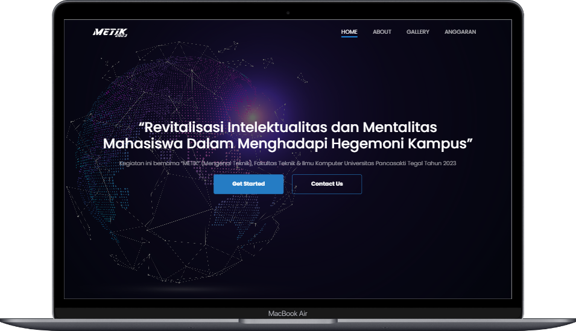
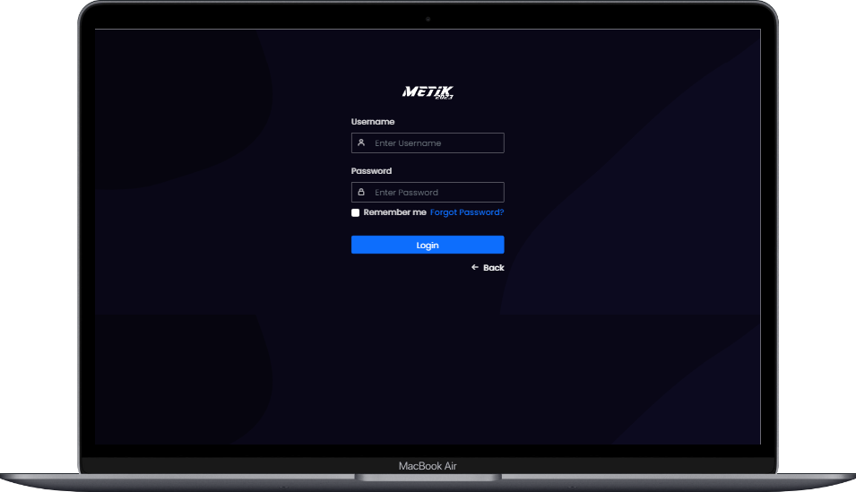

# METIK 2023

Metik adalah kegiatan untuk mengenal Teknik, yaitu Teknik Mesin, Teknik Industri, Teknik Informatika, Teknik Sipil, dan Sistem Informasi. Tujuan dari Metik adalah untuk pengenalan kampus, pengenalan Fakultas Teknik dan Ilmu Komputer, dan untuk menjalin ikatan emosional atau rasa memiliki Fakultas Teknik dan Ilmu Komputer.

Website Metik berisi tentang pangertian Metik, Gallery, dan Anggaran kegiatan. Website Metik dilengkapi dengan fitur CRUD untuk membuat, mengedit, dan menghapus konten yang ada di dalam website.

# Preview

- Home
  
  
- Login
  
  
- Edit Anggaran
  
  
- Edit Gallery
  

- Edit Content
  

# Version

  php version 8.1.6 database mysql
